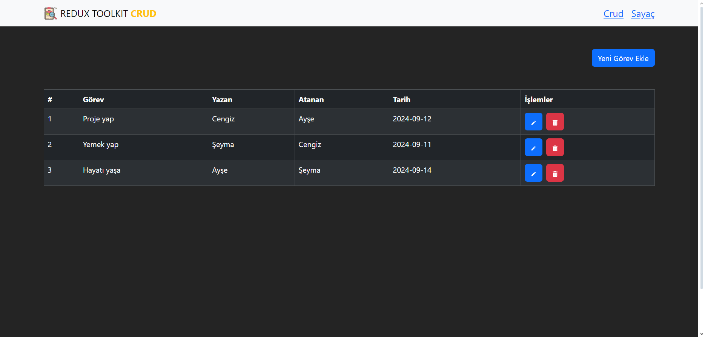

# Basit Todo Uygulaması

Bu proje, React ve Redux Toolkit kullanılarak durum yönetiminin sağlandığı, görevlerin (todo) eklenip düzenlenebildiği ve silinebildiği basit bir todo uygulamasıdır. API istekleri Axios ile yapılmakta olup, stil düzenlemeleri için React-Bootstrap ve simgeler için React Icons kullanılmaktadır.

## Özellikler

- **Todo Ekleme:** Yeni görev ekleyebilme.
- **Todo Düzenleme:** Mevcut görevleri düzenleyebilme.
- **Todo Silme:** Görevleri silebilme.
- **Redux Toolkit:** Durum yönetimi için kullanılır.
- **React-Bootstrap:** Kullanıcı arayüzü için stil bileşenleri.
- **React Icons:** İkon kullanımı.

## Proje Kurulumu

Projeyi yerel ortamınızda çalıştırmak için aşağıdaki adımları izleyin:

1. Projeyi klonlayın:

   ```bash
   git clone https://github.com/kullaniciadi/todo-uygulamasi.git
   ```

2. Proje dizinine gidin:

   ```bash
   cd todo-uygulamasi
   ```

3. Gerekli bağımlılıkları yükleyin:

   ```bash
   npm install
   ```

4. Uygulamayı başlatın:

   ```bash
   npm run dev
   ```

## Kullanılan Teknolojiler

- **React** - UI oluşturmak için
- **Redux Toolkit** - Durum yönetimi için
- **React-Bootstrap** - Stil düzenlemeleri için
- **React Icons** - İkonlar için

## Ekran Görüntüleri

### Anasayfa



## Katkıda Bulunma

Katkıda bulunmak isterseniz, pull request açabilir veya issue oluşturabilirsiniz.

# Redux-Toolkit-Crud-example-Project
